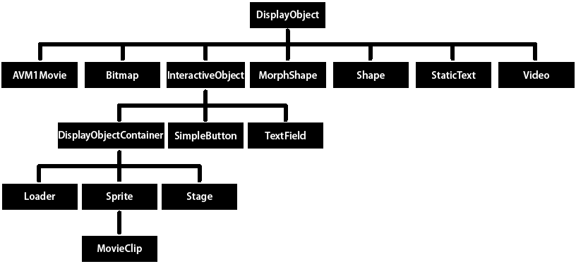

# Core display classes {#core-display-classes}

The openfl.display package includes classes for visual objects that can appear in OpenFL. The following illustration shows the subclass relationships of these core display object classes.

The illustration shows the class inheritance of display object classes. Note that some of these classes, specifically StaticText, TextField, and Video, are not in the openfl.display package, but they still inherit from the DisplayObject class.

All classes that extend the DisplayObject class inherit its methods and properties. For more information, see [Properties and methods of the DisplayObject class](working-with-display-objects.md#properties-and-methods-of-the-displayobject-class).

You can instantiate objects of the following classes contained in the openfl.display package:

*   Bitmap&mdash;You use the Bitmap class to define bitmap objects, either loaded from external files or rendered through Haxe. You can load bitmaps from external files through the Loader class. You can load GIF, JPG, or PNG files. You can also create a BitmapData object with custom data and then create a Bitmap object that uses that data. You can use the methods of the BitmapData class to alter bitmaps, whether they are loaded or created in Haxe. For more information, see [Loading display objects](loading-display-content-dynamically.md#loading-display-objects) and [Working with bitmaps](../working-with-bitmaps/README.md).

*   Loader&mdash;You use the Loader class to load external assets (either projects or graphics). For more information, see [Loading display content dynamically](loading-display-content-dynamically.md).

*   Shape&mdash;You use the Shape class to create vector graphics, such as rectangles, lines, circles, and so on. For more information, see [Using the drawing API](../using-the-drawing-api/README.md).

*   SimpleButton&mdash;A SimpleButton object is the OpenFL representation of a button symbol created in the Flash authoring tool. A SimpleButton instance has four button states: up, down, over, and hit test (the area that responds to mouse and keyboard events).

*   Sprite&mdash;A Sprite object can contain graphics of its own, and it can contain child display objects. (The Sprite class extends the DisplayObjectContainer class). For more information, see [Working with display object containers](working-with-display-objects\working-with-display-object-containers.md) and [Using the drawing API](../using-the-drawing-api/README.md).

*   MovieClip&mdash;A MovieClip object is the OpenFL form of a movie clip symbol created in the Flash authoring tool. In practice, a MovieClip is similar to a Sprite object, except that it also has a timeline. For more information, see [Working with movie clips](../working-with-movie-clips/README.md).

The following classes, which are not in the openfl.display package, are subclasses of the DisplayObject class:

*   The TextField class, included in the openfl.text package, is a display object for text display and input. For more information, see [Basics of Working with text](../basics-of-working-with-text/README.md).

<!-- 
*   The TextLine class, included in the openfl.text.engine package, is the display object used to display lines of text composed by the Flash Text Engine and the Text Layout Framework. For more information, see

    “Using the Flash

    Text Engine” on page 397

    and

    “Using the Text Layout Framework” on page 426

    .
-->

*   The Video class, included in the openfl.media package, is the display object used for displaying video files. For more information, see [Working with video](../working-with-video/README.md).

The following classes in the openfl.display package extend the DisplayObject class, but you cannot create instances of them. Instead, they serve as parent classes for other display objects, combining common functionality into a single class.

<!-- 
*   AVM1Movie&mdash;The AVM1Movie class is used to represent loaded projects that are authored in Haxe 1.0 and 2.0.
*   DisplayObjectContainer&mdash;The Loader, Stage, Sprite, and MovieClip classes each extend the DisplayObjectContainer class. For more information, see

    “Working with display object containers” on page 159

    .
-->

*   InteractiveObject&mdash;InteractiveObject is the base class for all objects used to interact with the mouse and keyboard. SimpleButton, TextField, Loader, Sprite, Stage, and MovieClip objects are all subclasses of the InteractiveObject class. For more information on creating mouse and keyboard interaction, see [Basics of user interaction](../basics-of-user-interaction/README.md).

*   MorphShape&mdash;These objects are created when you create a shape tween in the Flash authoring tool. You cannot instantiate them using Haxe, but they can be accessed from the display list.

*   Stage&mdash;The Stage class extends the DisplayObjectContainer class. There is one Stage instance for an application, and it is at the top of the display list hierarchy. To access the Stage, use the stage property of any DisplayObject instance. For more information, see [Setting Stage properties](working-with-display-objects\setting-stage-properties.md).

Also, the StaticText class, in the openfl.text package, extends the DisplayObject class, but you cannot create an instance of it in code. Static text fields are created only in SWF-based assets.

<!--

The following classes are not display objects or display object containers, and do not appear in the display list, but do display graphics on the stage. These classes draw into a rectangle, called a viewport, positioned relative to the stage.

*   &mdash;The StageVideo class displays video content, using hardware acceleration, when possible. This class is available starting in OpenFL 10.2\. For more information, see

    “Using the StageVideo class for hardware

    accelerated presentation” on page 512

    .
*   StageWebView&mdash;The StageWebView class displays HTML content. This class is available starting in AIR 2.5\. For more information, see

    “StageWebView objects” on page 1026

    .

The following fl.display classes provide functionality that parallels the openfl.display.Loader and LoaderInfo classes. Use these classes instead of their openfl.display counterparts if you are developing in the Flash Professional environment (CS5.5 or later). In that environment, these classes help solve issues involving TLF with RSL preloading. For more information, see

“Using the ProLoader and ProLoaderInfo classes” on page 202

.

*   fl.display.ProLoader—Analogous to openfl.display.Loader
*   fl.display.ProLoaderInfo—Analogous to openfl.display.LoaderInfo

-->